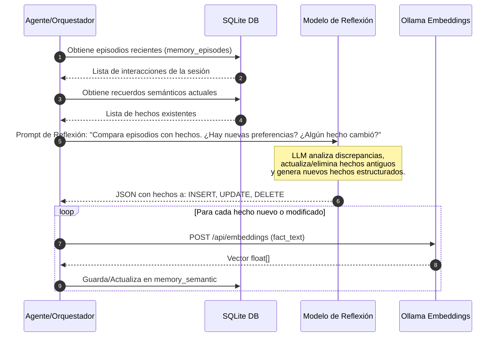

# Documento de Diseño Técnico: Sistema de Memoria para el Agente

Este documento detalla el diseño de arquitectura, el modelo de datos y los flujos de control para implementar un **Sistema de Memoria Jerárquico** para el agente. A diferencia de la Base de Conocimiento RAG (que almacena información estática de fuentes externas como artículos y PDFs), el Sistema de Memoria está centrado en el **agente y el usuario**: registra interacciones pasadas (episodios), extrae preferencias e información clave (semántica) y conserva instrucciones operativas (procedural).

---

## 1. RAG vs. Sistema de Memoria del Agente

Es fundamental distinguir la base de conocimiento RAG del sistema de memoria del agente:

| Característica | RAG (Base de Conocimiento) | Sistema de Memoria |
| :--- | :--- | :--- |
| **Propósito** | Buscar información en documentos externos indexados. | Mantener contexto, recordar al usuario y aprender de interacciones. |
| **Dinamismo** | Principalmente estático (solo lectura tras ingesta). | Altamente dinámico (escribe, edita y olvida constantemente). |
| **Origen del Dato** | URLs, artículos, PDFs, manuales de terceros. | Chats del usuario, logs de herramientas, decisiones del agente. |
| **Estructura** | Fragmentos (chunks) de texto arbitrarios. | Episodios estructurados, perfiles de usuario y hechos consolidados. |

---

## 2. Arquitectura de Memoria del Agente (Jerarquía Cognitiva)

Inspirado en modelos de cognición humana y arquitecturas como *MemGPT* y *CoALA*, el sistema divide la memoria en cuatro capas:

```mermaid
graph TD
    subgraph Memoria a Corto Plazo (Contexto Activo)
        WM[Memoria de Trabajo: Context Window / System Prompt]
    end

    subgraph Memoria a Largo Plazo (Persistente)
        EM[(Memoria Episódica: Historial de interacciones/herramientas)]
        SM[(Memoria Semántica: Hechos, Preferencias, Entidades)]
        PM[Memoria Procedural: Instrucciones de Herramientas y Código]
    end

    subgraph Procesos del Agente
        LLM[Motor LLM / Agente]
        Reflect[Consolidación y Reflexión Asíncrona]
    end

    LLM <-->|Lectura/Escritura rápida| WM
    LLM -->|Registra eventos| EM
    LLM <-->|Herramientas de búsqueda y guardado| SM
    Reflect -->|Lee episodios recientes| EM
    Reflect -->|Extrae, actualiza y sintetiza hechos| SM
```

1. **Memoria de Trabajo (Working Memory - Contexto Activo)**:
   - Es el "RAM" del agente. Contiene el historial de la conversación actual, el prompt de sistema y las variables de estado inmediatas.
2. **Memoria Episódica (Episodic Memory)**:
   - Registro cronológico de lo que ha sucedido. Almacena cada mensaje del usuario, respuesta del agente, pensamientos internos (scratchpad), herramientas llamadas y sus resultados correspondientes.
3. **Memoria Semántica (Semantic Memory)**:
   - Conocimiento destilado sobre el usuario y el mundo. Aquí se guardan datos como "El usuario prefiere Bun a Node.js", "El nombre del usuario es Oscar", etc. Se organiza como un almacén estructurado con embeddings vectoriales para búsquedas semánticas de baja latencia.
4. **Memoria Procedural (Procedural Memory)**:
   - Las reglas de comportamiento, definiciones de herramientas y flujos lógicos codificados en TypeScript.

---

## 3. Modelo de Datos en SQLite (`knowledge.db`)

Para simplificar la infraestructura y maximizar la cohesión del proyecto, el sistema de memoria compartirá la misma base de datos `knowledge.db`, pero utilizando tablas dedicadas.

```mermaid
erDiagram
    memory_sessions ||--o{ memory_episodes : "contiene"
    memory_sessions {
        int id PK
        text session_uuid UNIQUE
        text title
        datetime created_at
        datetime updated_at
    }
    memory_episodes {
        int id PK
        int session_id FK
        int step_index
        text role "user, assistant, system, tool"
        text content
        text tool_calls "JSON string"
        text thoughts "Cadena de pensamiento interno"
        datetime timestamp
    }
    memory_semantic {
        int id PK
        text category "preference, user_profile, learning, fact"
        text fact_text "Texto del hecho consolidado"
        blob embedding "1024-dim float32 vector de Ollama"
        float confidence "Confianza 0.0 - 1.0"
        text entity_associated "e.g., user, project_x"
        datetime created_at
        datetime updated_at
    }
```

### Definición de Tablas SQL

```sql
-- 1. Tabla para agrupar las sesiones de conversación
CREATE TABLE IF NOT EXISTS memory_sessions (
    id INTEGER PRIMARY KEY AUTOINCREMENT,
    session_uuid TEXT UNIQUE NOT NULL,
    title TEXT,
    created_at DATETIME DEFAULT CURRENT_TIMESTAMP,
    updated_at DATETIME DEFAULT CURRENT_TIMESTAMP
);

-- 2. Tabla para la memoria episódica (logs de ejecución y diálogos)
CREATE TABLE IF NOT EXISTS memory_episodes (
    id INTEGER PRIMARY KEY AUTOINCREMENT,
    session_id INTEGER NOT NULL,
    step_index INTEGER NOT NULL,
    role TEXT CHECK(role IN ('user', 'assistant', 'system', 'tool')) NOT NULL,
    content TEXT NOT NULL,
    tool_calls TEXT, -- Guardado como JSON Array
    thoughts TEXT, -- Permite guardar el razonamiento/scratchpad interno del agente
    timestamp DATETIME DEFAULT CURRENT_TIMESTAMP,
    FOREIGN KEY (session_id) REFERENCES memory_sessions(id) ON DELETE CASCADE
);

-- 3. Tabla para la memoria semántica (hechos y preferencias)
CREATE TABLE IF NOT EXISTS memory_semantic (
    id INTEGER PRIMARY KEY AUTOINCREMENT,
    category TEXT NOT NULL, -- 'preference', 'user_profile', 'learning', 'fact'
    fact_text TEXT NOT NULL,
    embedding BLOB NOT NULL, -- Vector de 1024 floats de Ollama
    confidence REAL DEFAULT 1.0,
    entity_associated TEXT DEFAULT 'user',
    created_at DATETIME DEFAULT CURRENT_TIMESTAMP,
    updated_at DATETIME DEFAULT CURRENT_TIMESTAMP
);
```

---

## 4. El Ciclo de Reflexión y Consolidación (Consolidation Loop)

Para evitar que la memoria semántica se sature con ruido episódico, el sistema implementa un proceso periódico de **Consolidación**.



### Algoritmo de Reflexión (Prompt Template sugerido)
```handlebars
Eres el subcomponente de consolidación de memoria del agente.
Se te proporciona:
1. Hechos ya conocidos sobre el usuario y el entorno (Memoria Semántica).
2. La conversación y acciones recientes del agente (Memoria Episódica).

Tu tarea es:
- Identificar nuevas preferencias del usuario, hechos estables o aprendizajes del agente.
- Detectar si algún hecho anteriormente conocido ha cambiado o es falso (conflictos).
- Generar una lista de acciones estructurada en JSON para actualizar la Memoria Semántica.

FORMATO DE SALIDA REQUERIDO (JSON):
{
  "insertions": [
    { "category": "preference", "fact_text": "Prefiere probar el código con Bun antes de Docker", "confidence": 0.9 }
  ],
  "updates": [
    { "id": 14, "fact_text": "Trabaja en el proyecto class1 usando TypeScript (actualizado)", "confidence": 1.0 }
  ],
  "deletions": [
    { "id": 5, "reason": "El usuario ya no usa Python para este backend" }
  ]
}
```

---

## 5. Herramientas del Servidor MCP de Memoria

El servidor MCP expondrá herramientas para que el agente gestione su propia memoria dinámicamente durante la conversación:

### 5.1 `save_memory_fact`
Permite al agente guardar de manera explícita un recuerdo semántico en caliente si detecta algo crucial en la interacción.
* **Zod Schema**:
  ```typescript
  {
    category: z.enum(["preference", "user_profile", "learning", "fact"]),
    factText: z.string().describe("El hecho o preferencia a recordar"),
    entityAssociated: z.string().default("user").describe("A quién o qué se asocia esta memoria")
  }
  ```

### 5.2 `search_agent_memories`
Realiza una búsqueda semántica usando embeddings sobre la tabla `memory_semantic`.
* **Zod Schema**:
  ```typescript
  {
    query: z.string().describe("Término de búsqueda, e.g., 'nombre del usuario' o 'preferencias de base de datos'"),
    limit: z.number().min(1).max(10).default(5)
  }
  ```

### 5.3 `delete_memory_fact`
Permite al agente olvidar un hecho que ya no es válido.
* **Zod Schema**:
  ```typescript
  {
    id: z.number().describe("ID del hecho semántico a eliminar")
  }
  ```

### 5.4 `log_episodic_event`
Registra un paso o evento específico de la sesión en la memoria episódica.
* **Zod Schema**:
  ```typescript
  {
    sessionUuid: z.string().describe("Identificador de la sesión de chat"),
    role: z.enum(["user", "assistant", "system", "tool"]),
    content: z.string().describe("El contenido del mensaje, resultado de herramienta o razonamiento"),
    thoughts: z.string().optional().describe("Razonamiento interno o scratchpad del agente"),
    toolCalls: z.array(z.any()).optional().describe("Lista de herramientas invocadas en este paso")
  }
  ```

---

## 6. Integración y Flujo de Trabajo

Cuando el agente inicia una interacción con el usuario:
1. **Inicialización**: El orquestador del agente consulta `search_agent_memories` con palabras clave generales de la sesión o carga el resumen del perfil del usuario (los hechos con categoría `user_profile` y `preference`).
2. **Inyección en el Contexto**: Estos hechos se inyectan en el *System Prompt* o al inicio de la *Memoria de Trabajo* (Working Memory), garantizando que el agente empiece conociendo las preferencias del usuario.
3. **Ejecución**: Durante la sesión, cada mensaje e intervención se registra mediante `log_episodic_event`.
4. **Cierre/Consolidación**: Al final de la conversación o mediante una tarea programada (cron), se ejecuta el proceso de consolidación para actualizar los hechos semánticos en base a los nuevos episodios.

---

## 7. Trade-offs y Decisiones de Diseño

1. **Uso de SQLite en memoria vs. almacenamiento persistente**:
   * *Decisión*: Persistir en `knowledge.db`. La memoria episódica y semántica debe ser duradera entre reinicios del agente.
2. **Embeddings locales**:
   * *Decisión*: Seguir usando `mxbai-embed-large` en Ollama para mantener coherencia con el diseño RAG y garantizar la privacidad local.
3. **Frecuencia de Reflexión**:
   * *Trade-off*: Reflexionar en cada mensaje añade un retraso considerable y costo de tokens.
   * *Decisión*: Ejecutar la reflexión de forma **asíncrona (background task)** al finalizar la sesión del usuario o de manera periódica, reduciendo el impacto en la latencia del diálogo en tiempo real.
