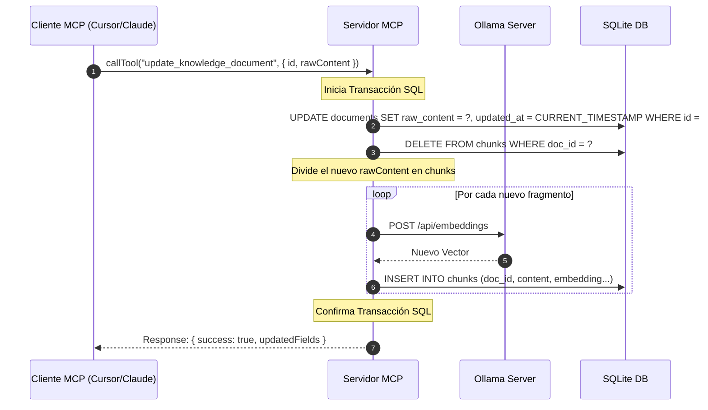
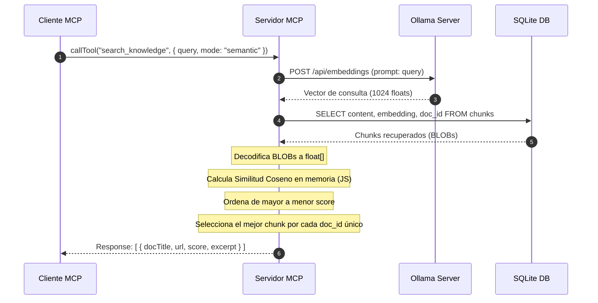

# Documento de Diseño Técnico: Base de Conocimiento Vectorial con MCP

Este documento detalla el diseño de arquitectura, el modelo de datos y los flujos de control para exponer la base de conocimiento vectorial como un **Servidor MCP (Model Context Protocol)**. Este servidor expone herramientas CRUD para que cualquier cliente compatible (como Cursor, Claude Desktop o Antigravity) pueda ingerir, editar, buscar y eliminar documentos de forma autónoma.

---

## 1. Arquitectura del Sistema (MCP)

En lugar de utilizar un script CLI directo, la lógica se expone a través de un canal de comunicación estándar stdio usando el protocolo MCP.

```mermaid
graph TD
    subgraph Cliente MCP
        Client[Editor / LLM: Cursor, Claude Desktop, Antigravity]
    end
    
    subgraph Servidor MCP (Knowledge Base)
        Server[Servidor MCP - Node.js/TS]
        Tools[Herramientas: CRUD + Search]
    end
    
    subgraph Almacenamiento Local
        DB[(knowledge.db SQLite)]
    end
    
    subgraph Inferencia Local
        Ollama[Ollama Server: mxbai-embed-large]
    end
    
    Client -->|Llamado de Herramientas: JSON-RPC| Server
    Server -->|Expone e implementa| Tools
    Tools -->|Transacciones SQL, FTS5| DB
    Tools -->|Genera embeddings| Ollama
```

### Componentes Tecnológicos
* **Protocolo de Comunicación**: JSON-RPC 2.0 sobre transporte `stdio` (entrada y salida estándar).
* **Servidor MCP**: Implementado con `@modelcontextprotocol/sdk/server/mcp.js`.
* **Motor de Base de Datos**: SQLite local (`better-sqlite3`) con triggers automáticos para indexación **FTS5**.
* **Inferencia Local**: Ollama con el modelo `mxbai-embed-large` para embeddings de 1024 dimensiones.

---

## 2. Definición de Herramientas MCP (Zod Schemas)

El servidor MCP expone las siguientes herramientas para realizar el ciclo CRUD completo y búsqueda semántica:

### 2.1 `ingest_knowledge_document`
Ingiere un documento a partir de una URL o texto crudo directamente.
* **Schema de Entrada**:
  ```typescript
  {
    url: z.string().url().describe("URL del documento a ingerir"),
    title: z.string().optional().describe("Título opcional. Si se omite, se extraerá del HTML"),
    sourceType: z.enum(["article", "tweet", "video", "pdf", "other"]).default("article").describe("Tipo de fuente del documento"),
    tags: z.array(z.string()).optional().describe("Etiquetas para categorizar el documento")
  }
  ```

### 2.2 `delete_knowledge_document`
Elimina un documento y todos sus fragmentos/embeddings asociados en cascada.
* **Schema de Entrada**:
  ```typescript
  {
    id: z.number().describe("ID numérico del documento a eliminar"),
    // Opcionalmente se puede borrar por URL
    url: z.string().url().optional().describe("URL del documento a eliminar si no se tiene el ID")
  }
  ```

### 2.3 `update_knowledge_document`
Actualiza la información de un documento. Si se actualiza el contenido de texto plano (`raw_content`), se regeneran automáticamente los chunks y embeddings.
* **Schema de Entrada**:
  ```typescript
  {
    id: z.number().describe("ID del documento a actualizar"),
    title: z.string().optional().describe("Nuevo título del documento"),
    tags: z.array(z.string()).optional().describe("Nueva lista de etiquetas"),
    rawContent: z.string().optional().describe("Nuevo texto completo. Si se provee, se recalcularán los fragmentos y embeddings")
  }
  ```

### 2.4 `search_knowledge`
Realiza búsquedas en la base de conocimiento usando similitud semántica (vectores) o búsqueda exacta (FTS5).
* **Schema de Entrada**:
  ```typescript
  {
    query: z.string().describe("Texto de consulta para buscar en la base de datos"),
    limit: z.number().min(1).max(20).default(5).describe("Límite de documentos más relevantes a retornar"),
    mode: z.enum(["semantic", "keyword", "hybrid"]).default("semantic").describe("Modo de búsqueda a emplear")
  }
  ```

### 2.5 `list_knowledge_documents`
Obtiene una lista paginada de todos los documentos indexados en el sistema.
* **Schema de Entrada**:
  ```typescript
  {
    limit: z.number().min(1).max(100).default(20).describe("Límite de documentos por página"),
    offset: z.number().default(0).describe("Número de registros a saltar para paginación")
  }
  ```

---

## 3. Modelo de Datos (`knowledge.db`)

El diseño de base de datos mantiene las tablas optimizadas para el procesamiento incremental de chunks:

```mermaid
erDiagram
    documents ||--o{ chunks : "contiene (CASCADE DELETE)"
    documents {
        int id PK
        text url UNIQUE
        text title
        text source_type
        text raw_content
        int word_count
        datetime created_at
        datetime updated_at
        text tags "JSON array"
    }
    chunks {
        int id PK
        int doc_id FK
        text content
        blob embedding "1024-dim float32 vector (4096 bytes)"
        int chunk_index
        int token_count
        datetime created_at
    }
```

* **Cascada**: La relación `doc_id` en `chunks` cuenta con la propiedad `ON DELETE CASCADE`. Al eliminar un documento, SQLite limpia inmediatamente de forma atómica todos sus fragmentos y representaciones vectoriales del disco.

---

## 4. Flujos de Trabajo en Detalle

### 4.1 Ingesta de Documento
El cliente solicita al servidor MCP ingerir una página. El servidor descarga, procesa y guarda la información.

```mermaid
sequenceDiagram
    autonumber
    participant Client as Cliente MCP (Cursor/Claude)
    participant MCP as Servidor MCP
    participant Web as Web (curl)
    participant Ollama as Ollama Server
    participant DB as SQLite DB

    Client->>MCP: callTool("ingest_knowledge_document", { url, tags })
    MCP->>Web: Fetch HTML de la URL
    Web---->>MCP: HTML Plano
    Note over MCP: Limpia HTML (extrae title y texto sin etiquetas)
    MCP->>DB: INSERT INTO documents (url, title, raw_content, tags)
    DB-->>MCP: doc_id
    Note over MCP: Divide texto en chunks (150 palabras, 20 overlap)
    loop Por cada fragmento
        MCP->>Ollama: POST /api/embeddings (prompt: fragmento)
        Ollama-->>MCP: Vector (1024 floats)
        Note over MCP: Serialización del vector a Buffer Float32LE
        MCP->>DB: INSERT INTO chunks (doc_id, content, embedding...)
    end
    MCP-->>Client: Response: { success: true, docId, chunksCount }
```

### 4.2 Edición y Regeneración de Embeddings
Cuando se modifica el contenido textual de un documento, el servidor limpia los chunks antiguos e indexa los nuevos bajo una transacción segura.



### 4.3 Búsqueda Vectorial Híbrida
Permite combinar búsqueda léxica (FTS5) con similitud coseno para una precisión óptima.



---

## 5. Implementación Matemática del Servidor

El motor matemático implementa la similitud coseno directamente en NodeJS para comparar el vector de consulta ($A$) contra los vectores guardados ($B$):

$$\text{Score}(A, B) = \frac{\sum_{i=0}^{1023} A_i \cdot B_i}{\sqrt{\sum_{i=0}^{1023} A_i^2} \cdot \sqrt{\sum_{i=0}^{1023} B_i^2}}$$

### Optimización de Consultas en SQLite
Para evitar la carga de toda la base de datos a memoria en búsquedas complejas, se pueden aplicar filtros previos por metadatos (ej. por tags o source_type) antes del procesamiento de la similitud del coseno en JavaScript:

```sql
SELECT c.content, c.embedding, d.title, d.url 
FROM chunks c
JOIN documents d ON c.doc_id = d.id
WHERE d.tags LIKE '%tag_buscado%' -- Filtro previo para acotar el cálculo vector
```
