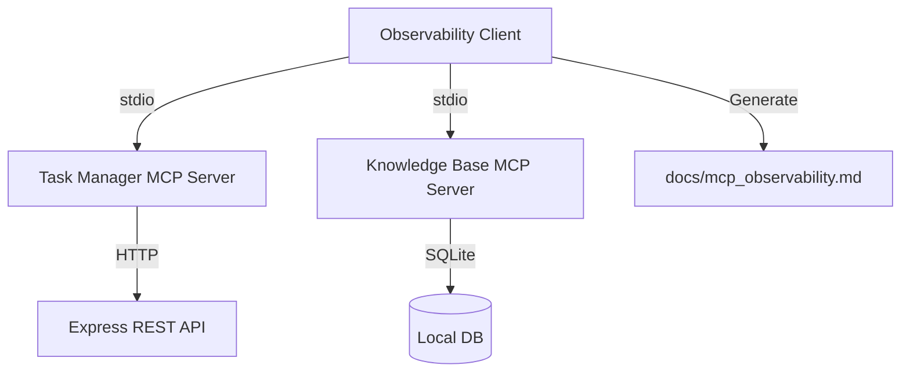
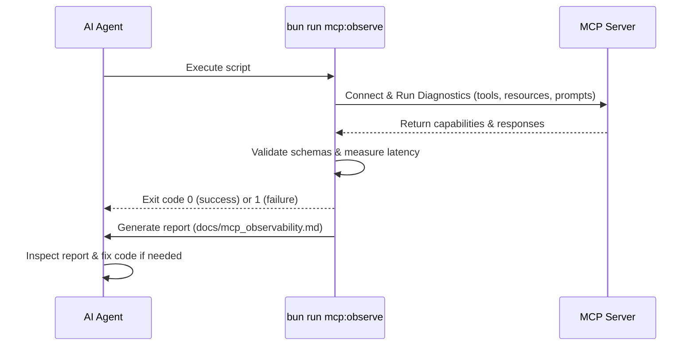

# MCP Observability & Self-Verification System

This document describes the design, capabilities, and usage of the MCP Client-based Observability and Self-Verification System. This system allows developers and autonomous AI agents to discover, test, monitor, and verify MCP server capabilities.

## Architecture Overview

The system consists of a TypeScript-based test client ([observability-client.ts](file:///Users/oscarcode/class1/src/mcp/observability-client.ts)) that connects to any running MCP server via the `StdioClientTransport`.



## Key Capabilities Tested

The client leverages all three core pillars of the Model Context Protocol (MCP):

### 1. Tools: Action Discovery & Execution
- **`listTools()`**: Automatically queries the server to fetch all registered tools, verifying that the server publishes its capabilities correctly.
- **`callTool(name, arguments)`**: Executes specific tools with sample arguments (e.g. `get_health`, `list_users`, `get_knowledge_stats`) to ensure code paths work and query database/REST APIs correctly.

### 2. Resources: Context Fetching
- **`listResources()`**: Discovers data channels (e.g., system logs, current app states) exposed by the server.
- **`readResource(uri)`**: Fetches raw data contexts (e.g. `health://status` or `users://list`) to verify the server properly parses URIs and formats application state.

### 3. Prompts: Reusable Templates
- **`listPrompts()`**: Lists all prompt templates provided directly by the server.
- **`getPrompt(name, arguments)`**: Resolves prompt templates (e.g. `summarize-system`, `ovents-users-info`) and verifies the server populates dynamic placeholders.

---

## Agent Self-Verification Loop

This system is specifically designed to allow autonomous AI coding agents to **verify their own implementations** independently without human intervention.



### Self-Verification Steps for the Agent
1. **Run the Diagnostic Tool:** Execute `bun run mcp:observe`.
2. **Check the Exit Code:** 
   - Exit Code `0`: The implementation is correct and fully functional.
   - Exit Code `1`: Something is broken (e.g., invalid JSON format, broken db query, API connection issue).
3. **Inspect the Output & Report:** Read [docs/mcp_observability.md](file:///Users/oscarcode/class1/docs/mcp_observability.md) to locate the exact tool, resource, or prompt that failed and see the corresponding error message.
4. **Iterate & Repair:** Make surgical fixes and repeat step 1.

---

## Performance Monitoring & Latency Tracking

For every discovery and execution call, the client measures response latency using `performance.now()`. This output is captured in a table inside [docs/mcp_observability.md](file:///Users/oscarcode/class1/docs/mcp_observability.md):

| Action / Operation | Duration (ms) | Status |
| :--- | :---: | :--- |
| `connect` | 70ms | ✅ OK |
| `listTools` | 5ms | ✅ OK |
| `callTool:get_health` | 12ms | ✅ OK |
| `listResources` | 1ms | ⚠️ UNSUPPORTED |

---

## How to Execute the Diagnostics

Run the observability suite manually using:
```bash
bun run mcp:observe
```
This script will:
1. Spin up a temporary Express API server on a random port.
2. Direct the Task Manager MCP Server to connect to that temporary port.
3. Establish a connection to both MCP servers.
4. Run comprehensive tool, resource, and prompt tests.
5. Print status diagnostics to the console.
6. Generate the [mcp_observability.md](file:///Users/oscarcode/class1/docs/mcp_observability.md) report.
7. Gracefully tear down the temporary API server.
